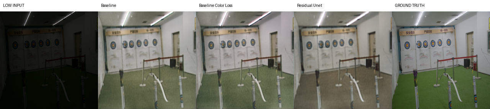
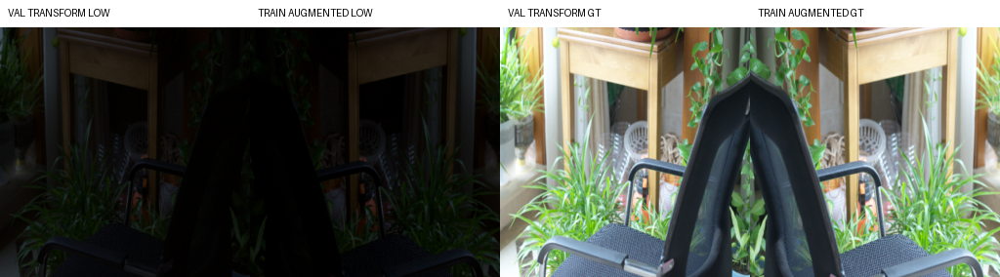

# Low-Light Image Enhancement with Cross-Dataset Generalization

Deep Learning project for **Low-Light Image Enhancement (LLIE)** with a focus on
cross-dataset generalization. The project trains compact image-to-image models
on paired low-light data and evaluates whether the learned enhancement behavior
transfers to different datasets and illumination conditions.

The repository contains a complete and reproducible PyTorch pipeline:

- deterministic dataset splits and preprocessing;
- a lightweight U-Net baseline;
- a ResidualUNet architectural variant;
- a color-constancy loss variant to mitigate color cast;
- paired and unpaired evaluation with PSNR, SSIM, NIQE, and BRISQUE;
- qualitative comparison scripts and failure analysis figures;
- report and oral-exam presentation sources.

## Highlights

- **Task:** low-light image enhancement from RGB images.
- **Training source:** LOL-v2 Real Captured paired dataset.
- **Cross-domain tests:** LOL-v1 `eval15` and ExDark.
- **Baseline:** compact Ronneberger-style U-Net.
- **Variants:** ResidualUNet and U-Net + color constancy loss.
- **Best in-domain PSNR:** ResidualUNet on LOL-v2 test, `18.25 dB`.
- **Best color/perceptual behavior:** color-loss U-Net, with improved NIQE on
  LOL-v2, LOL-v1, and ExDark.
- **Main finding:** more architectural capacity improved source-domain PSNR, but
  the color-aware loss produced the clearest cross-dataset qualitative gain.

## What This Project Demonstrates

This repository was developed as a complete academic deep learning project, but
it is structured like a small reproducible research codebase. It demonstrates:

- custom PyTorch `Dataset` and `DataLoader` pipelines for paired and unpaired
  image datasets;
- deterministic preprocessing, splitting, augmentation, and experiment setup;
- model implementation from scratch instead of relying on a high-level training
  framework;
- quantitative evaluation across in-domain and cross-domain datasets;
- no-reference image quality assessment for datasets without ground truth;
- qualitative result generation and failure analysis;
- report and presentation material suitable for an oral technical discussion.

## Results Summary

### Paired Evaluation

Higher PSNR and SSIM are better. Lower NIQE is better.

| Dataset | Run | PSNR ↑ | SSIM ↑ | NIQE ↓ | NIQE Δ ↓ |
| --- | --- | ---: | ---: | ---: | ---: |
| LOL-v2 test | Baseline U-Net | 17.726 | 0.8359 | 8.384 | +0.257 |
| LOL-v2 test | ResidualUNet | **18.251** | 0.8355 | 8.180 | +0.053 |
| LOL-v2 test | U-Net + Color Loss | 17.850 | **0.8362** | **7.316** | **-0.811** |
| LOL-v1 eval15 | Baseline U-Net | **20.031** | 0.8361 | 8.430 | -0.318 |
| LOL-v1 eval15 | ResidualUNet | 18.509 | 0.8197 | 7.414 | -1.334 |
| LOL-v1 eval15 | U-Net + Color Loss | 19.994 | **0.8373** | **6.924** | **-1.824** |

`NIQE Δ` compares the enhanced prediction against the corresponding low-light
input. Negative values mean the enhancement obtained a lower NIQE score than the
input.

### ExDark Unpaired Robustness

ExDark has no normal-light ground truth, so only no-reference metrics are used.

| Run | NIQE ↓ | NIQE Δ ↓ | BRISQUE ↓ | BRISQUE Δ ↓ |
| --- | ---: | ---: | ---: | ---: |
| Input | 8.116 | -- | 31.055 | -- |
| Baseline U-Net | 7.773 | -0.343 | 39.947 | +8.892 |
| ResidualUNet | 8.302 | +0.186 | 41.985 | +10.931 |
| U-Net + Color Loss | **7.113** | **-1.003** | **39.154** | **+8.099** |

The color-loss variant improves NIQE consistently, while BRISQUE shows that
enhancement can still amplify local artifacts. This is discussed in the report
as part of the failure analysis.

## Qualitative Examples

The project includes scripts to save side-by-side qualitative comparisons:

- low-light input;
- model prediction;
- ground truth when available.

Example LOL-v2 comparison:



Data augmentation examples:



Example figures used in the report are stored in:

```text
reports/images/
reports/images/failure/
outputs/*/history_figures/
```

Failure examples cover:

- color cast;
- halo artifacts;
- over-smoothing;
- hallucinated details;
- residual noise.

## Repository Structure

```text
configs/
    config.yaml

src/
    datasets/
        base_dataset.py
        lolv1_dataset.py
        lolv2_dataset.py
        exdark_dataset.py
    preprocessing/
        split.py
        augmentation.py
        transforms.py
    models/
        unet.py
        residual_unet.py
    losses/
        l1_loss.py
        ssim_loss.py
        color_constancy_loss.py
        combined_loss.py
    evaluation/
        metrics.py
        evaluator.py
    training/
        trainer.py
    utils/
        config.py
        dataset_utils.py
        io.py
        model_utils.py
        runtime.py
        visualization.py

scripts/
    make_splits.py
    train.py
    eval.py
    visualize_history.py
    visualize_results.py
    visualize_result_comp.py
    visualize_augmentations.py

reports/
    report.tex
    report.pdf
    presentation/
```

## Dataset Protocol

| Phase | Dataset | Usage |
| --- | --- | --- |
| Training | LOL-v2 Real Captured | Paired low-light and normal-light images |
| Validation | LOL-v2 Real Captured | Deterministic custom split from training set |
| In-domain test | LOL-v2 Real Captured official test | Paired evaluation |
| Cross-domain paired test | LOL-v1 `eval15` | Supervised evaluation |
| Cross-domain unpaired test | ExDark | NIQE, BRISQUE, qualitative analysis |

Datasets are **not redistributed** in this repository. They should be placed as:

```text
data/raw/
    LOL-v2/
    lol_dataset/
    ExDark_dataset/
```

Expected split sizes with the default seed:

| Dataset split | Samples |
| --- | ---: |
| LOL-v2 Real Captured train | 586 |
| LOL-v2 Real Captured validation | 103 |
| LOL-v2 official test | 100 |
| LOL-v1 `eval15` | 15 |
| ExDark stratified split | 120 |

The ExDark subset uses `10` deterministic images from each of the `12`
categories. It is used for robustness and qualitative analysis, not as a full
ExDark benchmark.

## Setup

Create and activate a virtual environment:

```bash
python3 -m venv .venv
source .venv/bin/activate
pip install --upgrade pip
pip install -r requirements.txt
```

Main dependencies:

- PyTorch;
- Pillow;
- NumPy;
- PyYAML;
- tqdm;
- matplotlib;
- pyiqa for NIQE and BRISQUE.

## Reproducing the Pipeline

### 1. Generate Splits

```bash
python3 scripts/make_splits.py
```

This creates:

```text
data/splits/lolv2_real_train.txt
data/splits/lolv2_real_val.txt
data/splits/ex_dark_split.txt
```

### 2. Train a Model

Edit `configs/config.yaml` to select the experiment name, model, and loss
weights. Then run:

```bash
python3 scripts/train.py
```

Outputs are saved under:

```text
outputs/<experiment_name>/
    best_model.pt
    history.json
```

### 3. Plot Training Curves

```bash
python3 scripts/visualize_history.py
```

This saves:

```text
outputs/<experiment_name>/history_figures/
    loss.png
    psnr.png
    ssim.png
```

### 4. Evaluate a Checkpoint

```bash
python3 scripts/eval.py
```

Metrics are saved to:

```text
outputs/<experiment_name>/metrics/
    lolv2_test.json
    lolv1_eval15.json
    exdark.json
```

### 5. Save Qualitative Results

```bash
python3 scripts/visualize_results.py
```

For multi-run comparisons:

```bash
python3 scripts/visualize_result_comp.py \
    --runs baseline residual_unet baseline_color_loss
```

### 6. Visualize Data Augmentation

```bash
python3 scripts/visualize_augmentations.py
```

This saves examples of the same training augmentation pipeline used by the
DataLoader.

## Configuration

The central configuration file is:

```text
configs/config.yaml
```

Important fields:

```yaml
experiment:
  name: baseline_color_loss
  seed: 42

data:
  image_size: 256
  batch_size: 8
  num_workers: 0

model:
  name: UNet
  base_features: 32

training:
  optimizer: AdamW
  lr: 0.0003
  early_stopping_patience: 10
  mixed_precision: auto

loss:
  l1_weight: 0.8
  ssim_weight: 0.3
  color_weight: 0.05
```

## Models

### U-Net Baseline

The baseline is a compact encoder-decoder U-Net with:

- four downsampling stages;
- bottleneck block;
- transposed-convolution upsampling;
- encoder-decoder skip connections;
- sigmoid output in `[0, 1]`.

It is intentionally simple and easy to inspect.

### ResidualUNet

ResidualUNet keeps the U-Net macro-structure but replaces standard convolutional
blocks with residual blocks. A `1x1` projection is used only when channel counts
change inside a residual block.

### Color-Loss Variant

The color-loss variant keeps the U-Net architecture unchanged and adds a
supervised color constancy term. It penalizes mismatch between predicted and
target RGB channel means and was introduced to mitigate grayish/desaturated
outputs.

## Losses

The main training loss is:

```text
L_total = λ1 * L1 + λ2 * SSIM_loss + λcolor * ColorConstancy
```

With the default color-loss experiment:

```text
λ1 = 0.8
λ2 = 0.3
λcolor = 0.05
```

For the baseline and ResidualUNet runs, `color_weight` is set to `0.0`.

## Evaluation Metrics

Full-reference metrics:

- **PSNR** for pixel-level fidelity;
- **SSIM** for local structural similarity.

No-reference metrics:

- **NIQE** for naturalness statistics;
- **BRISQUE** for spatial natural-scene quality.

NIQE is used for both paired and unpaired evaluation. BRISQUE is used for ExDark,
where no ground truth is available. No-reference metrics are interpreted
together with visual inspection because they do not directly measure fidelity to
a target image.

## Reproducibility Notes

The project fixes:

- Python random seed;
- NumPy seed;
- PyTorch seed;
- DataLoader generator seed;
- DataLoader worker seed;
- deterministic cuDNN flags when applicable.

Default seed:

```text
42
```

Experiments were run locally on a **MacBook Air with Apple M4 and 24 GB unified
memory**, using MPS when available. Exact bitwise reproducibility is not
guaranteed across hardware backends, especially on MPS, but the protocol,
splits, seed, and configuration are fixed.

## Report and Presentation

The final report and presentation are included:

```text
reports/report.pdf
reports/report.tex
reports/presentation.pdf
```

The report documents:

- dataset protocol and licensing;
- preprocessing and augmentation;
- model architecture;
- losses and metrics;
- quantitative results;
- qualitative analysis;
- failure taxonomy;
- future work.

## Future Work

The next experimental steps are:

- test gradient-aware losses for halo artifacts;
- test edge or perceptual losses for over-smoothing;
- explore noise-aware augmentation or denoising losses;
- apply the same mitigation losses to ResidualUNet;
- evaluate whether improvements transfer across LOL-v2, LOL-v1, and ExDark.

## Known Limitations

- The project is not intended to claim state-of-the-art LLIE performance.
- ExDark is evaluated on a balanced subset of `120` images, not on the full
  dataset.
- NIQE and BRISQUE are useful for no-reference analysis, but they can disagree
  with human visual preference.
- Exact bitwise reproducibility may vary across CPU, CUDA, and MPS backends.

## License and Dataset Terms

This repository does not redistribute the datasets. Please download each dataset
from its official source and follow its license and terms of use:

- LOL-v2: CVPR 2020 Semi-Supervised Low-Light Enhancement dataset release;
- LOL-v1: RetinexNet / BMVC 2018 LOL dataset;
- ExDark: Exclusively Dark Image Dataset.

The code is intended for academic and portfolio use.
